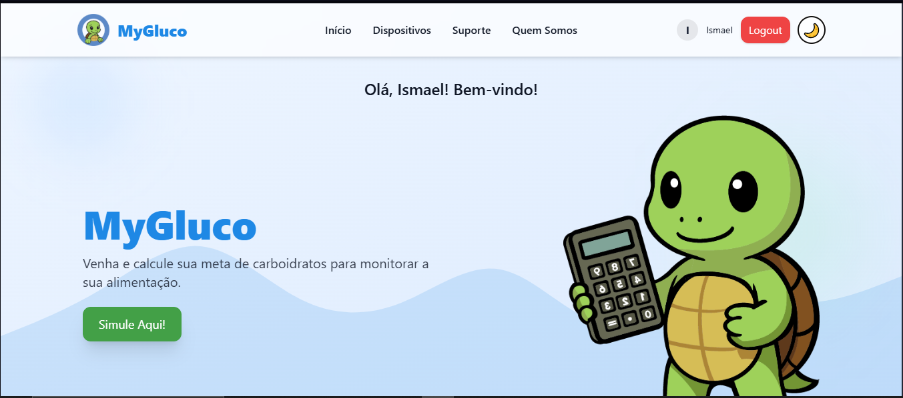
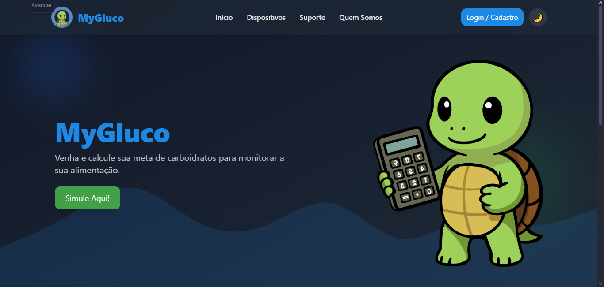
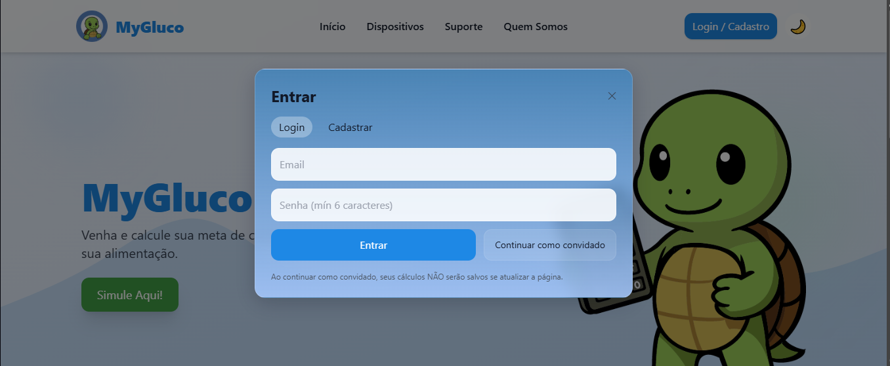
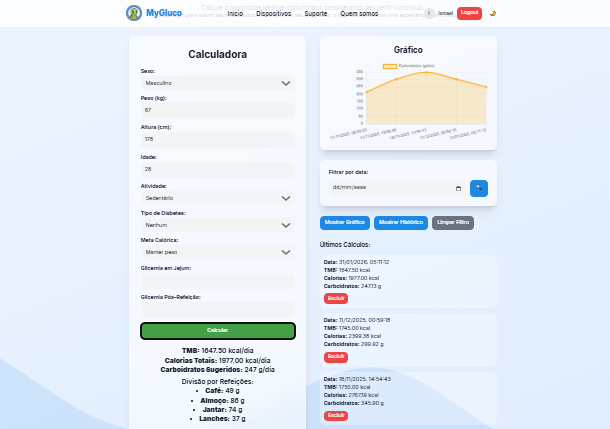
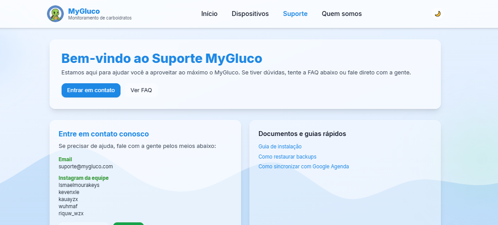

<h1 align="center">
📲 MyGluco - Landing Page   
</h1>

 
 

 

 <strong>Landing page oficial do projeto MyGluco</strong>  Uma apresentação visual e informativa da aplicação mobile de monitoramento glicêmico.
 

 🔗 
<a href="https://mygluco.vercel.app" target="_blank"><b>Acesse a landing page</b></a> 

  <h3>🛠️ Tecnologias Utilizadas</h3>

  <table align="center">
    <tr>
      <td align="center">
        
         HTML
      </td>
      <td align="center">
        
         Tailwind CSS
      </td>
      <td align="center">
        
         JavaScript
      </td>
      <td align="center">
        
         Firebase
      </td>
    </tr>
  </table>

<h2 align="center">🖼️ Visualização da Landing Page </h2>

<table align="center"> 
<tr> 
<td align="center">   Modo Dark </td> 
<td align="center">   Login </td> 
<td align="center"> 
  Controle Alimentar </td> 
<td align="center">   Página de Suporte </td> 
</tr> 
</table>

 

<h2>🏗️ Origem do projeto </h2>

O MyGluco surgiu como uma ideia para o Trabalho de Conclusão de Curso (TCC), com o objetivo de aplicar, na prática, os conhecimentos adquiridos ao longo da formação técnica, unindo teoria, tecnologia e impacto social. O projeto tem como base a ODS 3 da ONU – Saúde e Bem-Estar, que visa assegurar uma vida saudável e promover o bem-estar para todos, em todas as idades.

A proposta foi desenvolver uma solução digital capaz de auxiliar pessoas no controle da glicemia, contribuindo para a prevenção de complicações relacionadas ao diabetes, ao mesmo tempo em que servisse como um desafio técnico real para os integrantes do projeto.

Embora esta landing page tenha sido desenvolvida com HTML, Tailwind CSS e JavaScript, o aplicativo mobile foi construído utilizando React Native, Node.js e Firebase, permitindo escalabilidade, integração de dados e desenvolvimento multiplataforma.

 

  <h2> ⚠️ Observação importante </h2>

  

    Este repositório não executa o aplicativo mobile.
    Ele contém apenas a landing page de apresentação do projeto.
  

  

    Para acessar o código-fonte do aplicativo mobile, por favor, visite o repositório dedicado ao aplicativo MyGluco. que pode ser encontrado no seguinte link:
    

    <a href="https://github.com/Ismaelmourakeys/MyGlucoApp" target="_blank" style="font-weight:bold;font-size:15px;">MyGlucoApp</a>

## 📚 Aprendizados

- Estruturação de landing pages para projetos reais

- Uso de Tailwind CSS para layouts responsivos

- Organização visual para apresentação de aplicações

- Comunicação clara de soluções digitais

- Integração de design e funcionalidade em páginas web

- Prática de desenvolvimento front-end com HTML, CSS e JavaScript

## 👤 Autor

Desenvolvido por 
**Ismael Moura** 

🔗 [LinkedIn](www.linkedin.com/in/ismaelmourakeys) | [GitHub](https://github.com/Ismaelmourakeys)